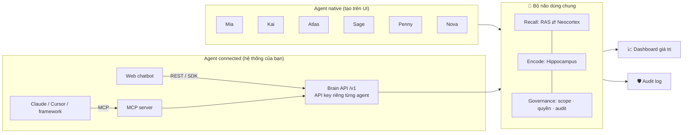
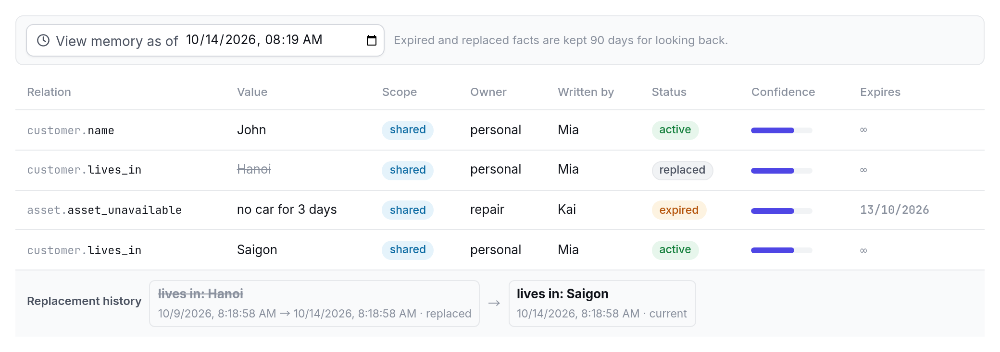
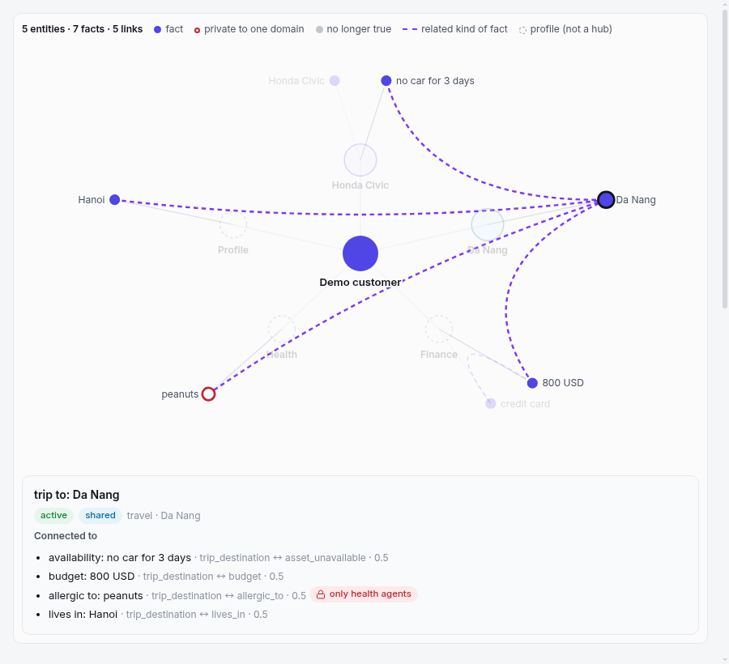
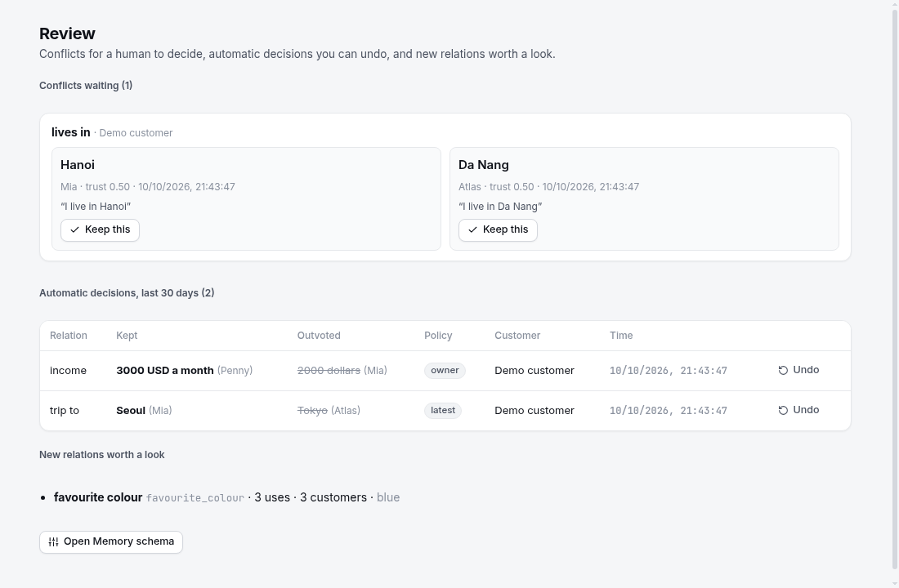

# 🧠 Agent Brain Hub

[English](README.md) · **Tiếng Việt**

[](https://github.com/leluong141996-dev/Agent-Brain-Hub/actions/workflows/ci.yml)
[](https://github.com/leluong141996-dev/Agent-Brain-Hub/releases/latest)
[](LICENSE)


**Bộ não tập trung cho mọi AI agent của doanh nghiệp.** Agent có thể tạo ngay trên giao diện, hoặc là agent đang chạy ở hệ thống khác rồi cắm vào bộ não qua REST API, SDK hay MCP. Tất cả dùng chung **một** bộ nhớ, nên điều một agent học được thì mọi agent khác đều biết. Kết quả: khách không phải kể lại, các agent bàn giao cho nhau liền mạch, và công ty tích luỹ tri thức từ mọi cuộc hội thoại.

Bộ nhớ được tổ chức theo mô hình bộ não người: 13 vùng não, hai vòng thức/ngủ, theo khung CoALA. Kiến trúc tham khảo từ tài liệu *Vita Cognitive Memory Architecture*. Giao diện cho phép **xem trực tiếp** từng vùng não hoạt động, và hỗ trợ **Tiếng Việt · English · 日本語**.

Yêu cầu: **Node.js ≥ 22** (hoặc chỉ cần Docker). Dữ liệu lưu bằng **SQLite** qua `better-sqlite3` (có sẵn bản build cho Linux/macOS/Windows; nếu nền tảng không có bản build sẵn thì `npm install` cần Python, make và trình biên dịch C++). Docker + GPU NVIDIA chỉ cần khi muốn chạy model local qua vLLM.

```bash
npm install
npm start                      # → http://localhost:4317  (UI)  ·  http://localhost:4317/v1  (Brain API)
npm test                       # unit test + bộ QA nghiệm thu
npm run e2e -- --lang vi|en|ja # bài test end-to-end trên server đang chạy
```

Hoặc chỉ cần **một lệnh** với Docker (không cần cài Node):

```bash
docker compose up -d                 # → http://localhost:4317 · dữ liệu nằm trong volume brain-data
docker compose --profile vllm up -d  # thêm Qwen3-4B chạy local qua vLLM (cần GPU NVIDIA)
```

Cấu hình (tuỳ chọn): `cp .env.example .env` rồi điền `PORT`, `BRAIN_ADMIN_TOKEN`, API key của nhà cung cấp LLM… Khi dùng profile `vllm`, vào **Cài đặt → vLLM** và đặt base URL là `http://vllm:8000/v1`. Nếu LLM đang chạy sẵn trên máy bạn (Ollama, LM Studio, vLLM), từ trong container hãy dùng `http://host.docker.internal:<cổng>/v1`, ví dụ `http://host.docker.internal:11434/v1` cho Ollama.

Không cần cấu hình gì vẫn chạy được (chế độ offline: luật + template). Muốn có LLM thật, xem [LLM](#llm-chọn-nhà-cung-cấp-ngay-trên-giao-diện).

---

## Concept



| Màn hình | Dùng để |
|---|---|
| 🧠 **Bộ não** | Xem live tín hiệu chạy qua 13 vùng não cho mỗi câu hỏi, kể cả câu hỏi đến từ agent bên ngoài qua API. Chat với agent native, xem thông tin được lấy từ kho nào, xem working/semantic/episodic/procedural memory. |
| 🤖 **Agents** | Tạo agent native hoặc connected, bật/tắt quyền đọc/ghi, cấp và xoay API key, lấy đoạn code tích hợp sẵn (cURL, JS, Python, MCP). |
| 📈 **Giá trị** | Số câu hỏi khách không phải trả lời lại, tri thức tái sử dụng chéo, handoff, tỉ lệ nhận gợi ý, skill tự học, rò rỉ bị chặn, ma trận luồng tri thức giữa các agent. |
| 🛡️ **Audit** | Mọi lượt đọc/ghi/chặn/gọi API: ai đọc ký ức của ai, cho khách nào, lúc nào. Lọc theo thao tác và tìm kiếm. |
| ⚙️ **Cài đặt** | Chọn nhà cung cấp LLM (Claude, GPT, Gemini, DeepSeek, model local…), tải danh sách model, kiểm tra kết nối, áp dụng ngay. Xem thông tin lưu trữ (file SQLite, dung lượng, số dòng). |

Sidebar bên trái chứa điều hướng, trạng thái mô hình, bộ chọn **ngôn ngữ** và **giao diện sáng/tối/theo hệ thống**. Màn hình Bộ não có bộ chọn **khách hàng** (bộ não nhớ riêng cho từng khách). Giao diện dùng hệ token màu cho cả hai chế độ, bộ icon SVG đồng bộ, và responsive tới màn hình điện thoại.

## Ba cách kết nối một agent

### 1. Native: tạo trên giao diện
Vào **Agents → Tạo agent → Native**, chọn lĩnh vực và persona. Bộ não sẽ tự trả lời bằng LLM của hub, và chat được ngay ở màn hình Bộ não.

### 2. Connected qua REST API / SDK
Tạo agent loại **Connected**. Hệ thống cấp API key, chỉ hiển thị một lần và lưu dạng hash. Agent của bạn vẫn dùng LLM riêng, theo vòng lặp:

```
recall (lấy ngữ cảnh) → agent trả lời bằng LLM của mình với promptBlock → remember (gửi lại để bộ não học)
```

```js
import { BrainClient } from './sdk/brain-client.js';
const brain = new BrainClient({ url: 'http://localhost:4317', apiKey: process.env.BRAIN_API_KEY });

const ctx = await brain.recall({ customerId: 'kh-001', text: userMessage, lang: 'ja' });
const reply = await myLLM({ system: ctx.promptBlock, user: ctx.redactedText });
await brain.remember({ traceId: ctx.traceId, reply });
```

Agent mẫu chạy được ngay (mở UI song song để xem bộ não sáng lên và hội thoại hiện trong chat):

```bash
BRAIN_API_KEY=abk_... npm run example
# tuỳ chọn: OWN_LLM_URL=http://localhost:8000/v1 OWN_LLM_MODEL=qwen3-4b BRAIN_LANG=ja
```

### 3. MCP: cho Claude Desktop/Code, Cursor và các agent framework
[mcp/server.mjs](mcp/server.mjs) là MCP server qua stdio, không có dependency. Mỗi instance đóng vai một agent connected và cung cấp 4 công cụ: `brain_recall`, `brain_remember`, `brain_profile`, `brain_feedback`.

```bash
claude mcp add agent-brain -e BRAIN_URL=http://localhost:4317 -e BRAIN_API_KEY=abk_... -- node /path/to/repo/mcp/server.mjs
```

Màn hình Agents có sẵn cấu hình `mcpServers` cho Claude Desktop/Cursor, với đường dẫn và key đã điền.

## Brain API (`/v1`, header `Authorization: Bearer <agent key>`)

| Method | Path | Body / query | Trả về |
|---|---|---|---|
| GET | `/v1/me` | | agent, domain, kind, permissions |
| POST | `/v1/recall` | `{customerId, text, lang, asOf?}` | `traceId, intent, salience, handoff, playbook, memories[]` (mỗi mục có `from`, `updatedAt`, `validUntil`, và `via` khi được kéo vào qua đồ thị thực thể), `suggestedActions[], promptBlock, redactedText` |
| POST | `/v1/remember` | `{traceId \| userText, reply, facts?: [{relation, value}], outcome?: {actionId, accepted}, lang}` (tên quan hệ bất kỳ; quan hệ mới bắt đầu ở dạng tạm) | `learned[]`, feedback |
| POST | `/v1/chat` | `{customerId, text, lang}` | bộ não tự trả lời (native qua API) |
| POST | `/v1/feedback` | `{traceId, actionId, accepted}` | bandit + skill promotion |
| GET | `/v1/profile` | `?customerId=&lang=` | các fact agent này được phép xem |

`/v1` bật CORS nên agent chạy trên trình duyệt cũng gọi được. Admin API `/api/*` (dùng cho UI) có thể khoá bằng `BRAIN_ADMIN_TOKEN`.

## Governance

- **Phạm vi ký ức:**
  - `private`: chỉ lĩnh vực sở hữu đọc được, ví dụ sức khoẻ, thu nhập, lỗi thiết bị;
  - `shared`: mọi agent có quyền đọc;
  - `global`: chính sách công ty.
- **Quyền từng agent** (bật/tắt ngay trên dòng của agent ở màn hình Agents):
  - `readShared`: có được đọc ký ức shared do agent khác ghi hay không;
  - `write`: có được ghi/học vào bộ não hay không. Agent đối tác có thể để chỉ-đọc.
- **Quy tắc ghi theo từng quan hệ:** mỗi quan hệ có một miền sở hữu và một quy tắc (`latest`, `owner`, `trust` hoặc `human`) để quyết định khi hai agent ghi hai giá trị khác nhau. Giá trị thua được giữ làm lịch sử, mọi quyết định tự động đều có audit và hoàn tác được, còn mâu thuẫn chưa giải thì chờ ở trang **Duyệt** (xem [Schema mở và quy tắc ghi](#schema-mở-và-quy-tắc-ghi)).
- **Audit log:** ghi lại mọi `read`, `write`, `blocked` (lượt đọc bị chặn vì private hoặc không có quyền), `recall`, `remember`, `handoff`, `feedback`, kèm agent ghi gốc. Đây cũng là nguồn số liệu cho dashboard giá trị.
- **Brainstem:** che PII (SĐT VN/JP, email, thẻ, CCCD) trước khi bất cứ thứ gì được ghi nhớ. Có phản xạ khủng hoảng bằng cả 3 ngôn ngữ.
- **API key:** lưu dạng SHA-256 và so sánh constant-time. Có thể xoay key; key cũ mất hiệu lực ngay.

## Dashboard giá trị — các chỉ số đo thế nào

| Chỉ số | Định nghĩa (tính từ audit log) |
|---|---|
| **Câu hỏi khách không phải trả lời lại** | Số fact khác nhau mà agent B đọc được từ ký ức do agent A ghi. Thời gian tiết kiệm ước tính với giả định 20 giây/câu, giả định này được hiển thị trên UI. |
| Tái sử dụng tri thức chéo | Tổng lượt đọc ký ức do agent khác ghi |
| Handoff liền mạch | Số lần khách chuyển agent mà ngữ cảnh được chuyển theo |
| Tỉ lệ nhận gợi ý | 👍 / (👍 + 👎) cho next best action |
| Skill tự học | Skill do Cerebellum promote, kèm số lượt chạy bằng playbook |
| Rò rỉ bị chặn | Lượt đọc private hoặc không có quyền bị RAS chặn |
| Luồng tri thức | Ma trận agent ghi × agent đọc. Ô ngoài đường chéo là tri thức được chia sẻ. |

## Agent có sẵn

| Agent | Lĩnh vực | Lưu ký ức | Phạm vi |
|---|---|---|---|
| **Mia** | Trợ lý cá nhân: hồ sơ, gia đình, lịch hẹn, sở thích | vĩnh viễn | shared |
| **Kai** | Sửa chữa & bảo dưỡng: xe, laptop, điện thoại, đồ gia dụng | 90 ngày | shared |
| **Atlas** | Du lịch & di chuyển | 1 năm | shared |
| **Sage** | Sức khoẻ | 10 năm | 🔒 private |
| **Penny** | Tài chính cá nhân (ngân sách được chia sẻ có chủ đích, thu nhập thì không) | 5 năm | 🔒 private |
| **Nova** | Mua sắm & đơn hàng | 180 ngày | shared |

## Ngôn ngữ

Chọn ở chân sidebar; lựa chọn được lưu trong trình duyệt. Ngôn ngữ áp dụng cho:
- giao diện và nhãn các vùng não;
- nhãn từng bước trong trace;
- câu trả lời của agent (LLM lẫn template; tiếng Nhật dùng kính ngữ), tóm tắt phiên, insight;
- kịch bản mẫu.

Bộ nhớ thì không phụ thuộc ngôn ngữ:
- Fact được trích từ câu Việt, Anh hay Nhật đều được (luật riêng cho tiếng Nhật, không cần dấu cách).
- Embedding chứa nhãn của cả 3 ngôn ngữ.
- Một fact ghi bằng tiếng Việt vẫn hiển thị với nhãn tiếng Nhật khi chọn 日本語.

API nhận tham số `lang: "vi" | "en" | "ja"`.

## Kiến trúc memory (13 vùng não)

| Vùng não | Service | File |
|---|---|---|
| Thalamus | Context Gateway: session, phát hiện chuyển agent, định tuyến | [thalamus.js](server/brain/thalamus.js) |
| Brainstem | Guardrail: PII, phản xạ khủng hoảng, kiểm duyệt đầu ra | [brainstem.js](server/brain/brainstem.js) |
| Amygdala | Salience: sentiment, urgency, churn, VIP → priority | [amygdala.js](server/brain/amygdala.js) |
| Corpus callosum | Handoff giữa các agent, uỷ quyền ghi | [corpusCallosum.js](server/brain/corpusCallosum.js) |
| Prefrontal cortex | Working memory + executive loop, gọi LLM | [prefrontal.js](server/brain/prefrontal.js), [respond.js](server/brain/respond.js) |
| Cerebellum | Playbook, skill promotion có version | [cerebellum.js](server/brain/cerebellum.js) |
| RAS | Retrieval: quyền → TTL → hybrid scoring → re-rank → token budget | [ras.js](server/brain/ras.js) |
| Neocortex | Episodic + semantic, tier hot/warm/cold, mâu thuẫn, phân quyền | [neocortex.js](server/brain/neocortex.js), [ontology.js](server/brain/ontology.js) |
| Basal ganglia | Next best action (bandit Thompson), học từ feedback | [basalGanglia.js](server/brain/basalGanglia.js) |
| Hippocampus | Trích fact (luật + LLM + fact tường minh từ API), consolidate | [hippocampus.js](server/brain/hippocampus.js) |
| Synaptic pruning | Quên: TTL, thay thế, suy giảm | [forgetting.js](server/brain/forgetting.js) |
| Default mode network | Phản tư: insight, rà soát skill | [dmn.js](server/brain/dmn.js) |
| Audit | Ai đọc/ghi gì | [audit.js](server/brain/audit.js) |

Bộ điều phối [server/brain/index.js](server/brain/index.js) có ba lối vào dùng chung phase `perceive` (Thalamus → … → Basal ganglia):

- `think()`: agent native, bộ não sinh câu trả lời.
- `recall()`: agent connected lấy gói ngữ cảnh.
- `remember()`: agent connected gửi lượt hội thoại để bộ não học.

Vòng ngủ (`sleep()`) chạy Hippocampus → Forgetting → DMN → Cerebellum.

### Khi nào bộ não ngủ

Ngoài nút **Chạy vòng ngủ**, bộ não tự ngủ theo ba cách ([sleepScheduler.js](server/brain/sleepScheduler.js)):

| Kích hoạt | Khi nào | Mặc định |
|---|---|---|
| **Im lặng** | Khách im lặng đủ lâu để coi như phiên đã kết thúc, và còn lượt hội thoại chưa hợp nhất | 30 phút (bằng ngưỡng mở phiên mới) |
| **Áp lực** | Số lượt chờ chạm ngưỡng. Working memory chỉ giữ 40 lượt gần nhất, nên nếu không ngủ sớm, các lượt cũ sẽ bị xoá trước khi vào bộ nhớ dài hạn | 24 lượt |
| **Ban đêm** | Mỗi ngày một lần, cho các khách có hoạt động từ đêm trước | 03:00 giờ máy chủ |

Chỉnh trong **Cài đặt → Vòng ngủ**; ở đó cũng có danh sách khách đang chờ ngủ và các lần ngủ gần đây kèm lý do. Lần ngủ tự động hiện trực tiếp trên màn hình bộ não như mọi trace khác. Ngủ thủ công và tự động dùng chung một hàng đợi nên không bao giờ chồng lên nhau. Biến môi trường đặt giá trị mặc định (`BRAIN_SLEEP_AUTO`, `BRAIN_SLEEP_IDLE_MINUTES`, `BRAIN_SLEEP_MAX_PENDING`, `BRAIN_SLEEP_NIGHTLY_AT`, xem [.env.example](.env.example)). Image Docker chạy theo giờ UTC: hãy đặt `TZ`, ví dụ `TZ=Asia/Ho_Chi_Minh`, để "03:00" đúng là ban đêm của bạn.

## Lưu trữ: SQLite

Toàn bộ bộ não nằm trong **một file SQLite** `data/brain.db` (chế độ WAL), tạo tự động ở lần chạy đầu.

| Bảng | Nội dung |
|---|---|
| `facts` | Semantic memory. Có cột `customer_id`, `relation`, `status`, `scope`, `owner_domain`, `source_agent_id`, `valid_until` (đánh index) và `embedding` (BLOB Float32). |
| `episodes` | Episodic memory. Có cột `customer_id`, `kind`, `scope`, `agent_id`, `created_at`, `expires_at` và `embedding`. |
| `audit` | Audit log append-only, **không bị cắt**. Dashboard giá trị tính bằng SQL trên toàn bộ lịch sử. |
| `agents`, `customers`, `working`, `skills`, `patterns`, `bandit`, `insights`, `traces` | Các phần còn lại của bộ não, mỗi dòng là một JSON. |
| `meta` | Phiên bản schema, đồng hồ mô phỏng, bộ đếm id, thống kê sử dụng. |

**Cách hoạt động:**
- Khi khởi động, trạng thái được nạp vào RAM; RAM đóng vai cache.
- Sau mỗi thay đổi (gộp trong 300 ms), server **chỉ ghi các dòng đã đổi**, trong một transaction.
- Khi nhận SIGINT/SIGTERM, server ghi nốt rồi đóng database gọn gàng.
- Với 20.000 episode: lần ghi đầu khoảng 0,2 giây, mỗi lượt chat sau đó chỉ ghi khoảng 10 dòng; nạp lại khi khởi động khoảng 0,2 giây.

**Truy vấn trực tiếp** được, ví dụ:
```bash
sqlite3 data/brain.db "SELECT relation, json_extract(data,'$.value'), scope FROM facts WHERE customer_id='kh-001'"
sqlite3 data/brain.db "SELECT source_agent_id, agent_id, COUNT(*) FROM audit WHERE op='read' GROUP BY 1,2"
```

**Sao lưu:** `sqlite3 data/brain.db ".backup backup.db"` (an toàn cả khi server đang chạy). Đổi đường dẫn bằng biến `BRAIN_DB`.

**Nâng cấp từ bản cũ:** nếu có `data/brain.json` (schema v3), dữ liệu được nhập vào SQLite ở lần chạy đầu, rồi file gốc được đổi tên thành `brain.imported.bak.json`. Đường dẫn file JSON cũ đổi bằng `BRAIN_DATA`.

**Giới hạn hiện tại:**
- Chỉ chạy được **một tiến trình** server, vì trạng thái được cache trong RAM.
- Tìm kiếm vector vẫn quét tuần tự trong RAM.

Hai giới hạn này sẽ được giải quyết khi chuyển sang PostgreSQL + pgvector (xem [Lộ trình](ROADMAP.md)).

## LLM: chọn nhà cung cấp ngay trên giao diện

Vào **Cài đặt → Mô hình ngôn ngữ**. Ở đó bạn:
1. chọn nhà cung cấp;
2. nhập API key (key chỉ lưu trên server trong `data/settings.json` với quyền 0600, không bao giờ gửi về trình duyệt);
3. bấm **Tải danh sách model** để lấy tên model trực tiếp từ nhà cung cấp, rồi **Kiểm tra kết nối** và **Lưu & áp dụng**.

Thay đổi có hiệu lực ngay, không cần khởi động lại.

| Nhà cung cấp | Giao thức | Base URL mặc định | Biến môi trường cho key |
|---|---|---|---|
| **Claude** (Anthropic) | Anthropic SDK chính thức | — | `ANTHROPIC_API_KEY` |
| **GPT** (OpenAI) | OpenAI Chat Completions | `https://api.openai.com/v1` | `OPENAI_API_KEY` |
| **Gemini** (Google) | Endpoint tương thích OpenAI | `https://generativelanguage.googleapis.com/v1beta/openai` | `GEMINI_API_KEY` |
| **DeepSeek** | Tương thích OpenAI | `https://api.deepseek.com/v1` | `DEEPSEEK_API_KEY` |
| **Mistral** | Tương thích OpenAI | `https://api.mistral.ai/v1` | `MISTRAL_API_KEY` |
| **Groq** | Tương thích OpenAI | `https://api.groq.com/openai/v1` | `GROQ_API_KEY` |
| **Grok** (xAI) | Tương thích OpenAI | `https://api.x.ai/v1` | `XAI_API_KEY` |
| **OpenRouter** (hàng trăm model) | Tương thích OpenAI | `https://openrouter.ai/api/v1` | `OPENROUTER_API_KEY` |
| **Together** | Tương thích OpenAI | `https://api.together.xyz/v1` | `TOGETHER_API_KEY` |
| **Ollama / vLLM / LM Studio** (local) | Tương thích OpenAI | `localhost:11434` / `:8000` / `:1234` | không cần |
| **Tuỳ chỉnh** | Mọi endpoint tương thích OpenAI | tự nhập | `BRAIN_LLM_API_KEY` |
| **Offline** | Luật + template | — | — |

- **Model chính** dùng để trả lời khách. **Model phụ** (tuỳ chọn) dùng cho trích fact, tóm tắt phiên và phản tư, nên chọn model rẻ và nhanh để tiết kiệm chi phí.
- **Tự thích nghi với từng nhà cung cấp:** khi bị từ chối tham số (lỗi 400/422), hệ thống tự điều chỉnh rồi gửi lại, và nhớ cho các lần sau:
  - `max_tokens` → `max_completion_tokens` (các model GPT dạng reasoning);
  - bỏ `temperature`;
  - bỏ JSON mode;
  - bỏ các tham số riêng của server local.
- **Không bao giờ gián đoạn:** nếu LLM lỗi, bộ não tự chuyển sang luật + template.
- **Biến môi trường** chỉ là cấu hình mặc định khi chưa lưu gì trên giao diện:
  - `BRAIN_LLM_PROVIDER`, `BRAIN_LLM_MODEL`, `BRAIN_LLM_BASE_URL`, `BRAIN_LLM_API_KEY`;
  - hoặc chỉ cần có key của một nhà cung cấp, ví dụ `OPENAI_API_KEY`, là hệ thống tự chọn nhà cung cấp đó;
  - `BRAIN_OFFLINE=1` tắt mọi lời gọi LLM;
  - `BRAIN_SETTINGS` đổi đường dẫn file cài đặt.

Chạy model local qua vLLM (Qwen3-4B, vừa GPU 12GB): `scripts/start-vllm.sh`, rồi chọn **vLLM** trong Cài đặt.

Ghi chú về vLLM:
- Image `latest` cần driver ≥ 575. Đổi bằng `VLLM_IMAGE=…`.
- Request JSON dùng `temperature 0.1` để né lỗi CUDA của vLLM 0.10.2 khi gộp batch.

### Bộ nhớ theo thời gian

Fact **bị vô hiệu chứ không bị xoá**. Khi "tôi chuyển đến Sài Gòn" thay cho "tôi sống ở Hà Nội", fact cũ vẫn giữ ngày tháng và liên kết tới fact mới; khi fact hết TTL, truy xuất ngừng dùng nó. Vòng ngủ xoá hẳn các fact đã kết thúc sau một khoảng giữ lịch sử: mặc định 90 ngày, chỉnh trong **Cài đặt → Vòng ngủ** hoặc qua `BRAIN_HISTORY_DAYS` (`0` thì xoá ngay như trước v0.5).

Bạn có thể hỏi **bộ não đã tin gì vào một thời điểm bất kỳ**:

```js
await brain.recall({ customerId, text: 'Đặt taxi từ nhà tôi', asOf: '2026-10-01T09:00:00Z' });
// → địa chỉ bộ não biết lúc đó, không phải địa chỉ hiện tại
```



`asOf` dùng được trên `POST /v1/recall` và trên tab Semantic, Episodic của màn hình Bộ não (*Xem bộ nhớ tại*). Việc xem quá khứ chỉ đọc: không thay đổi ký ức, được ghi vào audit log, và tuân theo đúng quyền đọc. Chuỗi thay thế của mỗi fact có ở `GET /api/facts/:id/history`.

### Bộ nhớ có liên kết (đồ thị thực thể)

Trong mỗi khách hàng, các fact được gom thành **thực thể**: "xe của tôi", "my car", "車" và "Honda Civic" là một chiếc xe; "Đà Nẵng" và "Da Nang" là một chuyến đi. Khi câu hỏi nhắc tới một thực thể hoặc khớp một fact, bước truy xuất đi theo liên kết sang các fact nối với nó, tối đa hai bước:

```text
Penny (tài chính): "Tuần này tôi có nên để dành tiền cho chiếc Civic không?"
→ "Civic" là chiếc xe, và chiếc xe đang phải sửa. Prompt nhận được:
  - sở hữu: Honda Civic (from Mia, 2 hours ago)
  - tình trạng: không có xe 3 ngày (from Kai, 2 hours ago, expires in 4 days, via: Honda Civic)
```

Liên kết là cùng một thực thể (chiếc Civic và việc sửa xe) hoặc hai loại fact liên quan (chuyến đi và việc không có xe, chuyến đi và chế độ ăn hay ngân sách). Đồ thị chỉ chạy trên những ký ức agent đang hỏi vốn đã được phép thấy, nên không bao giờ mang fact private sang miền khác, và bỏ qua fact đã hết hiệu lực. Hai khách hàng không bao giờ bị gộp.



Tab **Đồ thị** trong màn hình Bộ não hiển thị thực thể và liên kết của một khách, xem được cả ở thời điểm trong quá khứ; `GET /api/graph?customerId=&asOf=` trả về cùng dữ liệu. `npm run bench -- --no-graph` đo phần đồ thị mang lại (xem mục Benchmark).

### Schema mở và quy tắc ghi

Bộ não không còn bị giới hạn ở 19 loại quan hệ có sẵn. Thông tin lâu dài nào khách nói ra cũng có thể được ghi nhớ:

```text
"Màu yêu thích của tôi là xanh lá"            → màu yêu thích: xanh lá      (offline, vi / en / ja)
"I'm a gold member of your loyalty programme" → loyalty tier: gold          (khi có LLM)
remember({ facts: [{ relation: 'loyalty_tier', value: 'gold' }] })          (mọi agent kết nối)
```

Quan hệ bộ não chưa gặp bao giờ sẽ bắt đầu ở dạng **tạm**: chỉ miền đã ghi nó đọc được, giữ trong 30 ngày. Tên được chuẩn hoá ("Favorite Color" = `favourite_colour`), tên trông như bí mật (`password`, `pin`, `card_number`…) bị từ chối, và giá trị được che thông tin cá nhân. Trong **Cài đặt → Memory schema**, admin thấy mọi quan hệ kèm mức độ sử dụng, và có thể nâng cấp, gộp hoặc xoá các quan hệ mới. Một quan hệ mới chỉ hiện với miền khác khi admin nâng cấp nó, hoặc gộp nó vào một quan hệ gốc dạng shared.

Khi hai agent ghi **hai giá trị khác nhau** cho cùng một quan hệ, quy tắc của quan hệ đó quyết định:

| Quy tắc | Giá trị được giữ | Mặc định cho |
|---|---|---|
| `latest` | giá trị mới hơn | chuyến đi, ngân sách, tình trạng xe, ghế ngồi, size |
| `owner` | giá trị do miền sở hữu quan hệ ghi | thu nhập, phương thức thanh toán |
| `trust` | giá trị của agent đáng tin hơn (chênh rõ ràng, nếu không thì người quyết) | tên, nơi sống, nghề, chế độ ăn, sở thích |
| `human` | người quyết trên trang Duyệt | (chọn cho từng quan hệ) |

Giá trị còn lại được giữ làm lịch sử (`outvoted`, vẫn xem được bằng `asOf`). Quyết định được ghi audit, hiện trong trace trực tiếp và liệt kê ở trang **Duyệt**, nơi có thể hoàn tác. Hai quy tắc luôn đứng trước mọi policy: khách nói "đã đổi" thì luôn thắng, và nếu khách tự mâu thuẫn, bộ não hỏi lại khách chứ không tự chọn. **Độ tin cậy** của từng agent được học từ kết quả: người duyệt giữ giá trị nào, quyết định nào bị hoàn tác, và agent khác có xác nhận cùng giá trị không.



API: `GET /api/relations`, `PUT /api/relations/:name` (`edit`, `promote`, `merge`), `DELETE /api/relations/:name`, `GET /api/review`, `POST /api/review/resolve`, `POST /api/review/undo`.

### Tìm kiếm theo ngữ nghĩa (embeddings)

Mặc định, ký ức được so khớp bằng vector feature hashing chạy local: không cần mạng, không cần cài đặt, nhưng chỉ bắt được từ trùng nhau. Muốn tìm được cả câu diễn đạt khác ("Mai tôi tự lái ra sân bay được không?" → "không có xe 3 ngày"), hãy chọn model embedding trong **Cài đặt → Tìm kiếm theo ngữ nghĩa**: OpenAI, Gemini, Ollama, vLLM, LM Studio hoặc bất kỳ endpoint `/embeddings` tương thích OpenAI nào. Với tiếng Việt và tiếng Nhật, `bge-m3` chạy qua Ollama là lựa chọn local tốt.

- **Người dùng tự bật.** Chỉ có key nhà cung cấp trong biến môi trường thì không tự bật; hãy chọn trên giao diện hoặc đặt `BRAIN_EMBED_PROVIDER` (kèm `BRAIN_EMBED_MODEL`, `BRAIN_EMBED_BASE_URL`, `BRAIN_EMBED_API_KEY`).
- **Ghi không bao giờ chờ mạng.** Mọi ký ức luôn có vector hashing; một hàng đợi trong nền thêm vector của model, và tính lại toàn bộ khi đổi model. Cài đặt hiện tiến độ.
- **Truy xuất chờ tối đa 1,5 giây** để nhúng câu hỏi, quá thời gian thì dùng hashing. Live trace ghi rõ đang dùng cách so khớp nào.
- **Riêng tư.** Chỉ văn bản đã che PII được gửi đi, nhưng *toàn bộ* nội dung bộ nhớ, kể cả phạm vi private, đều được gửi tới nhà cung cấp. Với dữ liệu nhạy cảm, hãy dùng model local. Quyền đọc vẫn được kiểm tra sau bước truy xuất như trước, nên ký ức private dù giống đến đâu cũng không tới tay agent không được phép.

## Benchmark

`npm run bench` chấm bộ nhớ dùng chung trên 46 kịch bản nhiều agent: nhớ chéo giữa agent, fact hết hạn, mâu thuẫn, rò rỉ dữ liệu private, câu hỏi nhiều bước, hội thoại dài, khớp chính xác (mã đơn hàng, tên model), xem lại quá khứ, quan hệ ngoài danh sách có sẵn, và cách xử lý khi hai agent bất đồng, bằng tiếng Anh kèm các ca tiếng Việt và tiếng Nhật. Chạy offline dưới một giây, và CI chặn mọi thay đổi làm tụt một chỉ số chất lượng ([bench/README.md](bench/README.md)).

| v0.7.0 | Hashing (mặc định, offline) | Lai với `bge-m3` (Ollama, CPU) |
|---|---|---|
| Scenario pass rate | 97,8% | **100%** |
| Recall accuracy | 98,0% | **100%** |
| Schema mở / phân xử | **100%** / **100%** | **100%** / **100%** |
| Câu hỏi nhiều bước | **100%** (40% khi tắt đồ thị) | **100%** |
| Leak rate | **0%** | **0%** |
| Stale-use rate | **0%** | **0%** |
| Độ trễ recall (p50) | 0,6 ms | 145 ms* |
| Prompt tokens (trung bình) | 421 | 499 |

Đây là kịch bản do dự án tự viết, nên dùng để so các phiên bản của chính dự án. Đồ thị thực thể nâng tỷ lệ đạt khi chạy offline từ 84,8% lên 97,8% (`--no-graph` chạy cùng bộ kịch bản khi tắt đồ thị). Kịch bản duy nhất trượt khi chạy offline là một câu diễn đạt khác, không có từ nào trùng với ký ức. \* đo trong lúc máy đang chạy một benchmark khác (v0.6.0: 96 ms).

**Với LLM thật.** Chạy toàn bộ kịch bản với một LLM trên máy (`qwen3:4b` qua Ollama, LLM trích fact và viết bản tóm tắt phiên) đã tìm ra bốn lỗi, đều được sửa trong v0.7: model suy luận trả lời rỗng, bản tóm tắt làm mất mã định danh, mã định danh chính xác bị xếp hạng thấp, và câu hỏi về thu nhập. Với LLM, các kịch bản khớp chính xác tăng từ 0% lên 100%, và `open_schema` đạt 100%, kể cả quan hệ chỉ LLM mới đề xuất được. Số liệu đầy đủ khi chạy với LLM sẽ được bổ sung sau.

**Trên bộ dữ liệu công khai.** `npm run bench:longmemeval` chấm khả năng truy xuất trên [LongMemEval-S](https://huggingface.co/datasets/xiaowu0162/longmemeval-cleaned) (MIT, 470 câu hỏi, mỗi câu khoảng 50 phiên): phiên chứa câu trả lời có nằm gần đầu không? Với hashing local, nó nằm trong top 4 ở **53,2%** câu hỏi và trong top 10 ở **71,5%**. Điểm yếu là câu hỏi về sở thích (20% @4) và câu cần đủ mọi phiên bằng chứng. Độ chính xác của câu trả lời chưa được đo.

**Ở quy mô lớn.** Chỉ mục theo khách hàng giữ recall ở p50 0,6 ms / p95 1,9 ms với 100.000 episode (`npm run bench:scale`).

## Test

- `npm test`: 136 unit test, gồm:
  - bộ QA nghiệm thu của tài liệu: amnesia, contradiction, staleness, skill promotion, load 20k episode;
  - phân quyền và rò rỉ prompt;
  - tiếng Anh, tiếng Nhật;
  - agent connected (recall/remember), governance, xoay key, báo cáo giá trị;
  - lớp LLM: danh mục nhà cung cấp, tự thích nghi với một server giả lập khó tính kiểu OpenAI, lưu/ẩn key, tải danh sách model;
  - lưu trữ SQLite: mở lại thì dữ liệu còn nguyên (kể cả embedding), chỉ ghi các dòng thay đổi, audit không bị cắt và số liệu SQL khớp với cách tính trong bộ nhớ, nhập từ JSON cũ, reset;
  - vòng ngủ tự động (im lặng, áp lực, ban đêm), nguồn gốc và tuổi của fact trong prompt, nhà cung cấp embedding (với server giả lập), và chính bộ benchmark;
  - bộ nhớ theo thời gian (`asOf`, lịch sử) và đồ thị thực thể: gộp thực thể, truy xuất nhiều bước không bao giờ chạm tới fact private hay đã hết hạn, API đồ thị;
  - schema mở và quy tắc ghi: registry quan hệ (tên, bí mật, giới hạn, lưu qua restart), quan hệ tạm giữ riêng tư theo từng miền, nâng cấp / gộp / xoá, từng policy, hoàn tác, độ tin cậy, hàng chờ duyệt.
- `npm run bench`: benchmark bộ nhớ. 46 kịch bản nhiều agent (nhớ chéo, fact hết hạn, mâu thuẫn, rò rỉ, nhiều bước, hội thoại dài, khớp chính xác, xem lại quá khứ, schema mở, phân xử), chấm offline dưới một giây. Ngoài ra có `npm run bench:longmemeval` (bộ dữ liệu công khai, truy xuất) và `npm run bench:scale` (độ trễ khi bộ nhớ lớn). Xem [bench/README.md](bench/README.md); thêm kịch bản chỉ cần một file JSON.
- `npm run e2e -- --lang vi|en|ja`: 11 bước chạy trên server đang chạy, với bất kỳ cấu hình LLM nào (offline, Claude, GPT, model local…). Bao gồm cả agent connected qua SDK và MCP server qua stdio. Bài test dùng một khách hàng mới nên không đụng dữ liệu đang có, nhưng tua đồng hồ mô phỏng thêm 7 ngày.

## Cấu trúc

```
server/
  index.js          HTTP: admin API /api, Brain API /v1 (API key), SSE, static UI
  brain/            13 vùng não, audit, bộ điều phối (think / recall / remember / sleep)
  agents.js         6 lĩnh vực, intent vi/en/ja, hành động NBA, quyền mặc định
  store.js          lưu trữ SQLite (cache trong RAM + ghi theo dòng thay đổi, audit, nhập JSON cũ)
  embeddings.js     nhà cung cấp embedding (endpoint /embeddings tương thích OpenAI), tự bật
  i18n.js llm.js embed.js bus.js clock.js text.js
sdk/brain-client.js JS client cho agent connected (không dependency)
mcp/server.mjs      MCP server (stdio)
examples/           connected-agent.mjs: agent bên ngoài dùng LLM riêng + bộ não chung
public/             app.js (khung + màn hình bộ não), views/ (agents, value, audit, settings), i18n.js, icons.js, brain.js, styles.css (design tokens sáng/tối)
scripts/            start-vllm.sh, e2e.mjs
bench/              benchmark bộ nhớ: scenarios/*.json, bộ chạy, báo cáo, results/ (điểm nền theo phiên bản)
Dockerfile, docker-compose.yml, .env.example   chạy bằng một lệnh (volume dữ liệu, health check /healthz, profile vllm)
.github/            CI (test Node 22/24 + build Docker + e2e), mẫu issue/PR
test/               brain.test.js (bộ não, QA nghiệm thu), llm.test.js (nhà cung cấp LLM), store.test.js (SQLite)
data/               (tự tạo, đã gitignore) brain.db = bộ nhớ SQLite, settings.json = cấu hình LLM + API key
```


## Dữ liệu & bảo mật khi triển khai

- Toàn bộ bộ nhớ nằm trong `data/brain.db` (với Docker: volume `brain-data`, mount tại `/app/data`); cấu hình LLM và API key nằm trong `data/settings.json` (quyền 0600). Cả thư mục `data/` đã được gitignore — **đừng commit nó**.
- Admin UI và `/api/*` **mở cho bất kỳ ai truy cập được cổng** nếu không đặt `BRAIN_ADMIN_TOKEN`. Khi chạy ngoài máy cá nhân, hãy đặt biến này (UI sẽ hỏi token một lần) và để server sau reverse proxy có HTTPS.
- Agent bên ngoài chỉ dùng được `/v1/*` bằng API key của chính nó; quyền đọc/ghi bị giới hạn theo cấu hình của agent.

## Lộ trình

Mục tiêu: **lớp bộ nhớ cho hệ nhiều agent — đúng theo thời gian, có quản trị, và đo được.** Các bước tiếp theo:

| Phiên bản | Trọng tâm |
|---|---|
| ✅ **v0.3** | Benchmark bộ nhớ có cổng chặn trong CI; model embedding thay thế được |
| ✅ **v0.4** | Tìm kiếm lai, chỉ mục theo khách hàng, LongMemEval, benchmark một hub đang chạy |
| ✅ **v0.5** | Bộ nhớ theo thời gian: fact bị vô hiệu thay vì xoá, `recall({ asOf })`, lịch sử fact |
| ✅ **v0.6** | Đồ thị thực thể: thực thể theo từng khách, truy xuất nhiều bước kèm `via`, giao diện đồ thị |
| ✅ **v0.7** | Schema mở (registry quan hệ, quan hệ tạm), quy tắc ghi theo từng quan hệ, độ tin cậy của agent, trang Duyệt |
| **v0.8** | Quản trị bằng chính sách khai báo, PostgreSQL + pgvector, OpenTelemetry, multi-tenant |

Chi tiết, nguyên tắc và những gì không nằm trong kế hoạch: [ROADMAP.md](ROADMAP.md) (tiếng Anh).

## Đóng góp

Mọi đóng góp đều được chào đón: sửa tài liệu, dịch, viết code. Xem [CONTRIBUTING.md](CONTRIBUTING.md) để biết cách chạy dự án và quy trình PR. Các issue gắn nhãn [`good first issue`](https://github.com/leluong141996-dev/Agent-Brain-Hub/labels/good%20first%20issue) là chỗ bắt đầu tốt; câu hỏi và ý tưởng xin mở ở [Discussions](https://github.com/leluong141996-dev/Agent-Brain-Hub/discussions). Lịch sử thay đổi: [CHANGELOG.md](CHANGELOG.md).

Giấy phép: xem [LICENSE](LICENSE).
