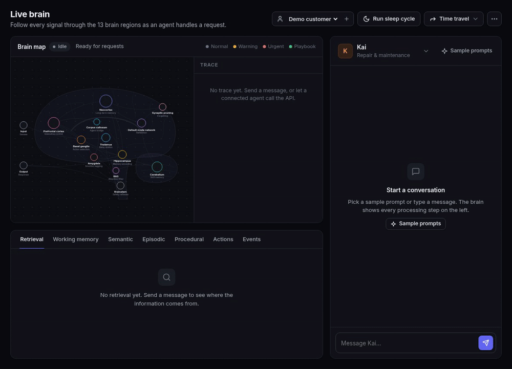
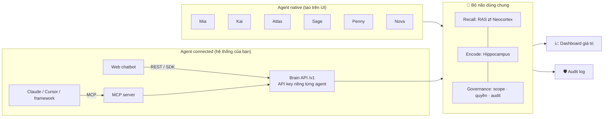

# 🧠 Agent Brain Hub

[English](README.md) · **Tiếng Việt**

[](https://github.com/leluong141996-dev/Agent-Brain-Hub/actions/workflows/ci.yml)
[](https://github.com/leluong141996-dev/Agent-Brain-Hub/releases/latest)
[](LICENSE)




**Bộ não tập trung cho mọi AI agent của doanh nghiệp.** Agent có thể tạo ngay trên giao diện, hoặc là agent đang chạy ở hệ thống khác rồi cắm vào bộ não qua REST API, SDK hay MCP. Tất cả dùng chung **một** bộ nhớ, nên điều một agent học được thì mọi agent khác đều biết. Kết quả: khách không phải kể lại, các agent bàn giao cho nhau liền mạch, và công ty tích luỹ tri thức từ mọi cuộc hội thoại.

Bộ nhớ được tổ chức theo mô hình bộ não người: 13 vùng não, hai vòng thức/ngủ, theo khung CoALA. Kiến trúc tham khảo từ tài liệu *Vita Cognitive Memory Architecture*. Giao diện cho phép **xem trực tiếp** từng vùng não hoạt động, và hỗ trợ **Tiếng Việt · English · 日本語**.

Yêu cầu: **Node.js ≥ 22** (hoặc chỉ cần Docker). Dữ liệu lưu bằng **SQLite** qua `better-sqlite3` (có sẵn bản build cho Linux/macOS/Windows; nếu nền tảng không có bản build sẵn thì `npm install` cần Python, make và trình biên dịch C++). Docker + GPU NVIDIA chỉ cần khi muốn chạy model local qua vLLM.

```bash
npm install
npm start                      # → http://localhost:4317  (UI)  ·  http://localhost:4317/v1  (Brain API)
npm test                       # unit test + bộ QA nghiệm thu
npm run e2e -- --lang vi|en|ja # bài test end-to-end trên server đang chạy
```

Hoặc chỉ cần **một lệnh** với Docker (không cần cài Node):

```bash
docker compose up -d                 # → http://localhost:4317 · dữ liệu nằm trong volume brain-data
docker compose --profile vllm up -d  # thêm Qwen3-4B chạy local qua vLLM (cần GPU NVIDIA)
```

Cấu hình (tuỳ chọn): `cp .env.example .env` rồi điền `PORT`, `BRAIN_ADMIN_TOKEN`, API key của nhà cung cấp LLM… Khi dùng profile `vllm`, vào **Cài đặt → vLLM** và đặt base URL là `http://vllm:8000/v1`. Nếu LLM đang chạy sẵn trên máy bạn (Ollama, LM Studio, vLLM), từ trong container hãy dùng `http://host.docker.internal:<cổng>/v1`, ví dụ `http://host.docker.internal:11434/v1` cho Ollama.

Không cần cấu hình gì vẫn chạy được (chế độ offline: luật + template). Muốn có LLM thật, xem [LLM](#llm-chọn-nhà-cung-cấp-ngay-trên-giao-diện).

---

## Concept



| Màn hình | Dùng để |
|---|---|
| 🧠 **Bộ não** | Xem live tín hiệu chạy qua 13 vùng não cho mỗi câu hỏi, kể cả câu hỏi đến từ agent bên ngoài qua API. Chat với agent native, xem thông tin được lấy từ kho nào, xem working/semantic/episodic/procedural memory. |
| 🤖 **Agents** | Tạo agent native hoặc connected, bật/tắt quyền đọc/ghi, cấp và xoay API key, lấy đoạn code tích hợp sẵn (cURL, JS, Python, MCP). |
| 📈 **Giá trị** | Số câu hỏi khách không phải trả lời lại, tri thức tái sử dụng chéo, handoff, tỉ lệ nhận gợi ý, skill tự học, rò rỉ bị chặn, ma trận luồng tri thức giữa các agent. |
| 🛡️ **Audit** | Mọi lượt đọc/ghi/chặn/gọi API: ai đọc ký ức của ai, cho khách nào, lúc nào. Lọc theo thao tác và tìm kiếm. |
| ⚙️ **Cài đặt** | Chọn nhà cung cấp LLM (Claude, GPT, Gemini, DeepSeek, model local…), tải danh sách model, kiểm tra kết nối, áp dụng ngay. Xem thông tin lưu trữ (file SQLite, dung lượng, số dòng). |

Sidebar bên trái chứa điều hướng, trạng thái mô hình, bộ chọn **ngôn ngữ** và **giao diện sáng/tối/theo hệ thống**. Màn hình Bộ não có bộ chọn **khách hàng** (bộ não nhớ riêng cho từng khách). Giao diện dùng hệ token màu cho cả hai chế độ, bộ icon SVG đồng bộ, và responsive tới màn hình điện thoại.

## Ba cách kết nối một agent

### 1. Native: tạo trên giao diện
Vào **Agents → Tạo agent → Native**, chọn lĩnh vực và persona. Bộ não sẽ tự trả lời bằng LLM của hub, và chat được ngay ở màn hình Bộ não.

### 2. Connected qua REST API / SDK
Tạo agent loại **Connected**. Hệ thống cấp API key, chỉ hiển thị một lần và lưu dạng hash. Agent của bạn vẫn dùng LLM riêng, theo vòng lặp:

```
recall (lấy ngữ cảnh) → agent trả lời bằng LLM của mình với promptBlock → remember (gửi lại để bộ não học)
```

```js
import { BrainClient } from './sdk/brain-client.js';
const brain = new BrainClient({ url: 'http://localhost:4317', apiKey: process.env.BRAIN_API_KEY });

const ctx = await brain.recall({ customerId: 'kh-001', text: userMessage, lang: 'ja' });
const reply = await myLLM({ system: ctx.promptBlock, user: ctx.redactedText });
await brain.remember({ traceId: ctx.traceId, reply });
```

Agent mẫu chạy được ngay (mở UI song song để xem bộ não sáng lên và hội thoại hiện trong chat):

```bash
BRAIN_API_KEY=abk_... npm run example
# tuỳ chọn: OWN_LLM_URL=http://localhost:8000/v1 OWN_LLM_MODEL=qwen3-4b BRAIN_LANG=ja
```

### 3. MCP: cho Claude Desktop/Code, Cursor và các agent framework
[mcp/server.mjs](mcp/server.mjs) là MCP server qua stdio, không có dependency. Mỗi instance đóng vai một agent connected và cung cấp 4 công cụ: `brain_recall`, `brain_remember`, `brain_profile`, `brain_feedback`.

```bash
claude mcp add agent-brain -e BRAIN_URL=http://localhost:4317 -e BRAIN_API_KEY=abk_... -- node /path/to/repo/mcp/server.mjs
```

Màn hình Agents có sẵn cấu hình `mcpServers` cho Claude Desktop/Cursor, với đường dẫn và key đã điền.

## Brain API (`/v1`, header `Authorization: Bearer <agent key>`)

| Method | Path | Body / query | Trả về |
|---|---|---|---|
| GET | `/v1/me` | | agent, domain, kind, permissions |
| POST | `/v1/recall` | `{customerId, text, lang}` | `traceId, intent, salience, handoff, playbook, memories[], suggestedActions[], promptBlock, redactedText` |
| POST | `/v1/remember` | `{traceId \| userText, reply, facts?: [{relation, value}], outcome?: {actionId, accepted}, lang}` | `learned[]`, feedback |
| POST | `/v1/chat` | `{customerId, text, lang}` | bộ não tự trả lời (native qua API) |
| POST | `/v1/feedback` | `{traceId, actionId, accepted}` | bandit + skill promotion |
| GET | `/v1/profile` | `?customerId=&lang=` | các fact agent này được phép xem |

`/v1` bật CORS nên agent chạy trên trình duyệt cũng gọi được. Admin API `/api/*` (dùng cho UI) có thể khoá bằng `BRAIN_ADMIN_TOKEN`.

## Governance

- **Phạm vi ký ức:**
  - `private`: chỉ lĩnh vực sở hữu đọc được, ví dụ sức khoẻ, thu nhập, lỗi thiết bị;
  - `shared`: mọi agent có quyền đọc;
  - `global`: chính sách công ty.
- **Quyền từng agent** (bật/tắt ngay trên dòng của agent ở màn hình Agents):
  - `readShared`: có được đọc ký ức shared do agent khác ghi hay không;
  - `write`: có được ghi/học vào bộ não hay không. Agent đối tác có thể để chỉ-đọc.
- **Single-writer-per-entity:** mỗi relation có đúng một lĩnh vực được ghi. Agent khác ghi thì Corpus callosum uỷ quyền cho owner.
- **Audit log:** ghi lại mọi `read`, `write`, `blocked` (lượt đọc bị chặn vì private hoặc không có quyền), `recall`, `remember`, `handoff`, `feedback`, kèm agent ghi gốc. Đây cũng là nguồn số liệu cho dashboard giá trị.
- **Brainstem:** che PII (SĐT VN/JP, email, thẻ, CCCD) trước khi bất cứ thứ gì được ghi nhớ. Có phản xạ khủng hoảng bằng cả 3 ngôn ngữ.
- **API key:** lưu dạng SHA-256 và so sánh constant-time. Có thể xoay key; key cũ mất hiệu lực ngay.

## Dashboard giá trị — các chỉ số đo thế nào

| Chỉ số | Định nghĩa (tính từ audit log) |
|---|---|
| **Câu hỏi khách không phải trả lời lại** | Số fact khác nhau mà agent B đọc được từ ký ức do agent A ghi. Thời gian tiết kiệm ước tính với giả định 20 giây/câu, giả định này được hiển thị trên UI. |
| Tái sử dụng tri thức chéo | Tổng lượt đọc ký ức do agent khác ghi |
| Handoff liền mạch | Số lần khách chuyển agent mà ngữ cảnh được chuyển theo |
| Tỉ lệ nhận gợi ý | 👍 / (👍 + 👎) cho next best action |
| Skill tự học | Skill do Cerebellum promote, kèm số lượt chạy bằng playbook |
| Rò rỉ bị chặn | Lượt đọc private hoặc không có quyền bị RAS chặn |
| Luồng tri thức | Ma trận agent ghi × agent đọc. Ô ngoài đường chéo là tri thức được chia sẻ. |

## Agent có sẵn

| Agent | Lĩnh vực | Lưu ký ức | Phạm vi |
|---|---|---|---|
| **Mia** | Trợ lý cá nhân: hồ sơ, gia đình, lịch hẹn, sở thích | vĩnh viễn | shared |
| **Kai** | Sửa chữa & bảo dưỡng: xe, laptop, điện thoại, đồ gia dụng | 90 ngày | shared |
| **Atlas** | Du lịch & di chuyển | 1 năm | shared |
| **Sage** | Sức khoẻ | 10 năm | 🔒 private |
| **Penny** | Tài chính cá nhân (ngân sách được chia sẻ có chủ đích, thu nhập thì không) | 5 năm | 🔒 private |
| **Nova** | Mua sắm & đơn hàng | 180 ngày | shared |

## Ngôn ngữ

Chọn ở chân sidebar; lựa chọn được lưu trong trình duyệt. Ngôn ngữ áp dụng cho:
- giao diện và nhãn các vùng não;
- nhãn từng bước trong trace;
- câu trả lời của agent (LLM lẫn template; tiếng Nhật dùng kính ngữ), tóm tắt phiên, insight;
- kịch bản mẫu.

Bộ nhớ thì không phụ thuộc ngôn ngữ:
- Fact được trích từ câu Việt, Anh hay Nhật đều được (luật riêng cho tiếng Nhật, không cần dấu cách).
- Embedding chứa nhãn của cả 3 ngôn ngữ.
- Một fact ghi bằng tiếng Việt vẫn hiển thị với nhãn tiếng Nhật khi chọn 日本語.

API nhận tham số `lang: "vi" | "en" | "ja"`.

## Kiến trúc memory (13 vùng não)

| Vùng não | Service | File |
|---|---|---|
| Thalamus | Context Gateway: session, phát hiện chuyển agent, định tuyến | [thalamus.js](server/brain/thalamus.js) |
| Brainstem | Guardrail: PII, phản xạ khủng hoảng, kiểm duyệt đầu ra | [brainstem.js](server/brain/brainstem.js) |
| Amygdala | Salience: sentiment, urgency, churn, VIP → priority | [amygdala.js](server/brain/amygdala.js) |
| Corpus callosum | Handoff giữa các agent, uỷ quyền ghi | [corpusCallosum.js](server/brain/corpusCallosum.js) |
| Prefrontal cortex | Working memory + executive loop, gọi LLM | [prefrontal.js](server/brain/prefrontal.js), [respond.js](server/brain/respond.js) |
| Cerebellum | Playbook, skill promotion có version | [cerebellum.js](server/brain/cerebellum.js) |
| RAS | Retrieval: quyền → TTL → hybrid scoring → re-rank → token budget | [ras.js](server/brain/ras.js) |
| Neocortex | Episodic + semantic, tier hot/warm/cold, mâu thuẫn, phân quyền | [neocortex.js](server/brain/neocortex.js), [ontology.js](server/brain/ontology.js) |
| Basal ganglia | Next best action (bandit Thompson), học từ feedback | [basalGanglia.js](server/brain/basalGanglia.js) |
| Hippocampus | Trích fact (luật + LLM + fact tường minh từ API), consolidate | [hippocampus.js](server/brain/hippocampus.js) |
| Synaptic pruning | Quên: TTL, thay thế, suy giảm | [forgetting.js](server/brain/forgetting.js) |
| Default mode network | Phản tư: insight, rà soát skill | [dmn.js](server/brain/dmn.js) |
| Audit | Ai đọc/ghi gì | [audit.js](server/brain/audit.js) |

Bộ điều phối [server/brain/index.js](server/brain/index.js) có ba lối vào dùng chung phase `perceive` (Thalamus → … → Basal ganglia):

- `think()`: agent native, bộ não sinh câu trả lời.
- `recall()`: agent connected lấy gói ngữ cảnh.
- `remember()`: agent connected gửi lượt hội thoại để bộ não học.

Vòng ngủ (`sleep()`) chạy Hippocampus → Forgetting → DMN → Cerebellum.

## Lưu trữ: SQLite

Toàn bộ bộ não nằm trong **một file SQLite** `data/brain.db` (chế độ WAL), tạo tự động ở lần chạy đầu.

| Bảng | Nội dung |
|---|---|
| `facts` | Semantic memory. Có cột `customer_id`, `relation`, `status`, `scope`, `owner_domain`, `source_agent_id`, `valid_until` (đánh index) và `embedding` (BLOB Float32). |
| `episodes` | Episodic memory. Có cột `customer_id`, `kind`, `scope`, `agent_id`, `created_at`, `expires_at` và `embedding`. |
| `audit` | Audit log append-only, **không bị cắt**. Dashboard giá trị tính bằng SQL trên toàn bộ lịch sử. |
| `agents`, `customers`, `working`, `skills`, `patterns`, `bandit`, `insights`, `traces` | Các phần còn lại của bộ não, mỗi dòng là một JSON. |
| `meta` | Phiên bản schema, đồng hồ mô phỏng, bộ đếm id, thống kê sử dụng. |

**Cách hoạt động:**
- Khi khởi động, trạng thái được nạp vào RAM; RAM đóng vai cache.
- Sau mỗi thay đổi (gộp trong 300 ms), server **chỉ ghi các dòng đã đổi**, trong một transaction.
- Khi nhận SIGINT/SIGTERM, server ghi nốt rồi đóng database gọn gàng.
- Với 20.000 episode: lần ghi đầu khoảng 0,2 giây, mỗi lượt chat sau đó chỉ ghi khoảng 10 dòng; nạp lại khi khởi động khoảng 0,2 giây.

**Truy vấn trực tiếp** được, ví dụ:
```bash
sqlite3 data/brain.db "SELECT relation, json_extract(data,'$.value'), scope FROM facts WHERE customer_id='kh-001'"
sqlite3 data/brain.db "SELECT source_agent_id, agent_id, COUNT(*) FROM audit WHERE op='read' GROUP BY 1,2"
```

**Sao lưu:** `sqlite3 data/brain.db ".backup backup.db"` (an toàn cả khi server đang chạy). Đổi đường dẫn bằng biến `BRAIN_DB`.

**Nâng cấp từ bản cũ:** nếu có `data/brain.json` (schema v3), dữ liệu được nhập vào SQLite ở lần chạy đầu, rồi file gốc được đổi tên thành `brain.imported.bak.json`. Đường dẫn file JSON cũ đổi bằng `BRAIN_DATA`.

**Giới hạn hiện tại:**
- Chỉ chạy được **một tiến trình** server, vì trạng thái được cache trong RAM.
- Tìm kiếm vector vẫn quét tuần tự trong RAM.

Hai giới hạn này sẽ được giải quyết khi chuyển sang PostgreSQL + pgvector (xem [Hướng lên production](#hướng-lên-production)).

## LLM: chọn nhà cung cấp ngay trên giao diện

Vào **Cài đặt → Mô hình ngôn ngữ**. Ở đó bạn:
1. chọn nhà cung cấp;
2. nhập API key (key chỉ lưu trên server trong `data/settings.json` với quyền 0600, không bao giờ gửi về trình duyệt);
3. bấm **Tải danh sách model** để lấy tên model trực tiếp từ nhà cung cấp, rồi **Kiểm tra kết nối** và **Lưu & áp dụng**.

Thay đổi có hiệu lực ngay, không cần khởi động lại.

| Nhà cung cấp | Giao thức | Base URL mặc định | Biến môi trường cho key |
|---|---|---|---|
| **Claude** (Anthropic) | Anthropic SDK chính thức | — | `ANTHROPIC_API_KEY` |
| **GPT** (OpenAI) | OpenAI Chat Completions | `https://api.openai.com/v1` | `OPENAI_API_KEY` |
| **Gemini** (Google) | Endpoint tương thích OpenAI | `https://generativelanguage.googleapis.com/v1beta/openai` | `GEMINI_API_KEY` |
| **DeepSeek** | Tương thích OpenAI | `https://api.deepseek.com/v1` | `DEEPSEEK_API_KEY` |
| **Mistral** | Tương thích OpenAI | `https://api.mistral.ai/v1` | `MISTRAL_API_KEY` |
| **Groq** | Tương thích OpenAI | `https://api.groq.com/openai/v1` | `GROQ_API_KEY` |
| **Grok** (xAI) | Tương thích OpenAI | `https://api.x.ai/v1` | `XAI_API_KEY` |
| **OpenRouter** (hàng trăm model) | Tương thích OpenAI | `https://openrouter.ai/api/v1` | `OPENROUTER_API_KEY` |
| **Together** | Tương thích OpenAI | `https://api.together.xyz/v1` | `TOGETHER_API_KEY` |
| **Ollama / vLLM / LM Studio** (local) | Tương thích OpenAI | `localhost:11434` / `:8000` / `:1234` | không cần |
| **Tuỳ chỉnh** | Mọi endpoint tương thích OpenAI | tự nhập | `BRAIN_LLM_API_KEY` |
| **Offline** | Luật + template | — | — |

- **Model chính** dùng để trả lời khách. **Model phụ** (tuỳ chọn) dùng cho trích fact, tóm tắt phiên và phản tư, nên chọn model rẻ và nhanh để tiết kiệm chi phí.
- **Tự thích nghi với từng nhà cung cấp:** khi bị từ chối tham số (lỗi 400/422), hệ thống tự điều chỉnh rồi gửi lại, và nhớ cho các lần sau:
  - `max_tokens` → `max_completion_tokens` (các model GPT dạng reasoning);
  - bỏ `temperature`;
  - bỏ JSON mode;
  - bỏ các tham số riêng của server local.
- **Không bao giờ gián đoạn:** nếu LLM lỗi, bộ não tự chuyển sang luật + template.
- **Biến môi trường** chỉ là cấu hình mặc định khi chưa lưu gì trên giao diện:
  - `BRAIN_LLM_PROVIDER`, `BRAIN_LLM_MODEL`, `BRAIN_LLM_BASE_URL`, `BRAIN_LLM_API_KEY`;
  - hoặc chỉ cần có key của một nhà cung cấp, ví dụ `OPENAI_API_KEY`, là hệ thống tự chọn nhà cung cấp đó;
  - `BRAIN_OFFLINE=1` tắt mọi lời gọi LLM;
  - `BRAIN_SETTINGS` đổi đường dẫn file cài đặt.

Chạy model local qua vLLM (Qwen3-4B, vừa GPU 12GB): `scripts/start-vllm.sh`, rồi chọn **vLLM** trong Cài đặt.

Ghi chú về vLLM:
- Image `latest` cần driver ≥ 575. Đổi bằng `VLLM_IMAGE=…`.
- Request JSON dùng `temperature 0.1` để né lỗi CUDA của vLLM 0.10.2 khi gộp batch.

## Test

- `npm test`: 32 unit test, gồm:
  - bộ QA nghiệm thu của tài liệu: amnesia, contradiction, staleness, skill promotion, load 20k episode;
  - phân quyền và rò rỉ prompt;
  - tiếng Anh, tiếng Nhật;
  - agent connected (recall/remember), governance, xoay key, báo cáo giá trị;
  - lớp LLM: danh mục nhà cung cấp, tự thích nghi với một server giả lập khó tính kiểu OpenAI, lưu/ẩn key, tải danh sách model;
  - lưu trữ SQLite: mở lại thì dữ liệu còn nguyên (kể cả embedding), chỉ ghi các dòng thay đổi, audit không bị cắt và số liệu SQL khớp với cách tính trong bộ nhớ, nhập từ JSON cũ, reset.
- `npm run e2e -- --lang vi|en|ja`: 11 bước chạy trên server đang chạy, với bất kỳ cấu hình LLM nào (offline, Claude, GPT, model local…). Bao gồm cả agent connected qua SDK và MCP server qua stdio. Bài test dùng một khách hàng mới nên không đụng dữ liệu đang có, nhưng tua đồng hồ mô phỏng thêm 7 ngày.

## Cấu trúc

```
server/
  index.js          HTTP: admin API /api, Brain API /v1 (API key), SSE, static UI
  brain/            13 vùng não, audit, bộ điều phối (think / recall / remember / sleep)
  agents.js         6 lĩnh vực, intent vi/en/ja, hành động NBA, quyền mặc định
  store.js          lưu trữ SQLite (cache trong RAM + ghi theo dòng thay đổi, audit, nhập JSON cũ)
  i18n.js llm.js embed.js bus.js clock.js text.js
sdk/brain-client.js JS client cho agent connected (không dependency)
mcp/server.mjs      MCP server (stdio)
examples/           connected-agent.mjs: agent bên ngoài dùng LLM riêng + bộ não chung
public/             app.js (khung + màn hình bộ não), views/ (agents, value, audit, settings), i18n.js, icons.js, brain.js, styles.css (design tokens sáng/tối)
scripts/            start-vllm.sh, e2e.mjs
Dockerfile, docker-compose.yml, .env.example   chạy bằng một lệnh (volume dữ liệu, health check /healthz, profile vllm)
.github/            CI (test Node 22/24 + build Docker + e2e), mẫu issue/PR
test/               brain.test.js (bộ não, QA nghiệm thu), llm.test.js (nhà cung cấp LLM), store.test.js (SQLite)
data/               (tự tạo, đã gitignore) brain.db = bộ nhớ SQLite, settings.json = cấu hình LLM + API key
```


## Dữ liệu & bảo mật khi triển khai

- Toàn bộ bộ nhớ nằm trong `data/brain.db` (với Docker: volume `brain-data`, mount tại `/app/data`); cấu hình LLM và API key nằm trong `data/settings.json` (quyền 0600). Cả thư mục `data/` đã được gitignore — **đừng commit nó**.
- Admin UI và `/api/*` **mở cho bất kỳ ai truy cập được cổng** nếu không đặt `BRAIN_ADMIN_TOKEN`. Khi chạy ngoài máy cá nhân, hãy đặt biến này (UI sẽ hỏi token một lần) và để server sau reverse proxy có HTTPS.
- Agent bên ngoài chỉ dùng được `/v1/*` bằng API key của chính nó; quyền đọc/ghi bị giới hạn theo cấu hình của agent.

## Hướng lên production

- **Lưu trữ:** ✅ đã chuyển sang SQLite. Bước tiếp theo: PostgreSQL + pgvector để chạy nhiều tiến trình và có index vector thật (lớp `store.js` đã tách riêng nên các vùng não không phải đổi). Sau đó: working memory sang Redis, event bus sang Kafka/NATS, embedding API thật thay cho feature hashing.
- **Xác thực:** thay admin token bằng SSO/RBAC. Bổ sung scope và hạn dùng cho API key, cùng rate limit theo agent.
- **Vận hành:** vòng ngủ chạy bằng worker/cron thay vì nút bấm. Multi-tenant theo công ty.
- **Tích hợp dữ liệu:** kết nối một chiều với data warehouse để làm giàu fact.

## Đóng góp

Mọi đóng góp đều được chào đón: sửa tài liệu, dịch, viết code. Xem [CONTRIBUTING.md](CONTRIBUTING.md) để biết cách chạy dự án và quy trình PR. Các issue gắn nhãn [`good first issue`](https://github.com/leluong141996-dev/Agent-Brain-Hub/labels/good%20first%20issue) là chỗ bắt đầu tốt; câu hỏi và ý tưởng xin mở ở [Discussions](https://github.com/leluong141996-dev/Agent-Brain-Hub/discussions). Lịch sử thay đổi: [CHANGELOG.md](CHANGELOG.md).

Giấy phép: xem [LICENSE](LICENSE).
